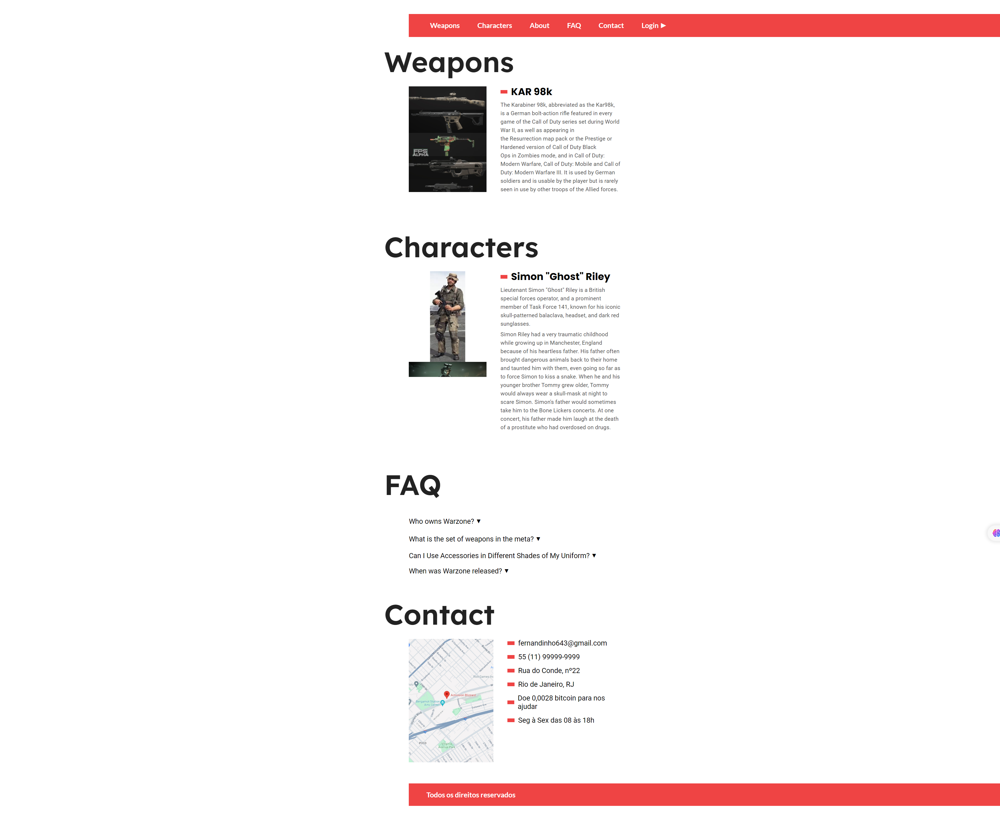

  <h1> Warzone Website </h1>

  <a href="#-projeto"> Projeto </a> &nbsp;&nbsp;|&nbsp;&nbsp;
  <a href="#-tecnologias"> Tecnologias </a> &nbsp;&nbsp;|&nbsp;&nbsp;

  
  
  
  
  

  

## 💻 Projeto

Website para praticar a manipulação de elementos DOM e práticas avançadas de posicionamento com Grid Layout.
Uso de Accordion e Menu Tabs por imagens de 'Weapons' e 'Characters'. 
  
## 🚀 Tecnologias

Este projeto foi desenvolvido com as seguintes tecnologias: 

### Front end
- HTML
- CSS (Grid Layout)
- SASS (pré-processador)
- JavaScript
- Figma

### Implantação em produção
- Front-end web: Github Pages

### Bibliotecas
- [Google Fonts](https://fonts.google.com/)
- [FontAwesome](https://fontawesome.com/)

### Utilitários
- [Icons8](https://icons8.com)
- [IconFinder](https://www.iconfinder.com/)

---

Feito por Felipe Castro Ferreira 👦🏻 👋🏻 [Venha conferir meu portfólio](https://github.com/FelipeCastro2021?tab=repositories) - Orientação: [Origamid](https://www.origamid.com/)

[Acesse o Design do Projeto](https://www.figma.com/design/KNzAwIyrumu5r1W2nKljQU/Practice-JS?node-id=0-1&t=lPHaukhGyjbC39Cp-0)
  
[Acesse meu Linkedin](https://www.linkedin.com/in/felipe-castro-ferreira/)
